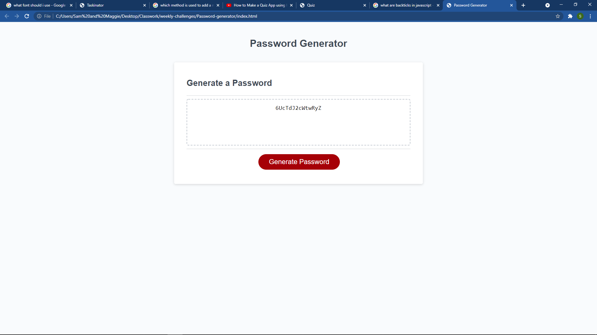

# Password-generator
Excercise to write javaScript code which functions well as a random password generator.

## Motivation, What I Did, and What I Learned
This has been the toughest project so far in the bootcamp. I struggled with the javaScript logic. I came up with some good components, but my lack of understanding was keeping things from functioning as they should. I spent a ton of time on trial and error. I attempted to follow some of the methods of Florin Pop by watching a youtube video and studying his code on codepen. It didn't work out great, as I couldn't get things to work properly in my application. I eventually branched off and went down a simpler route. I feel like the logic isn't too professional, but it functions, and it's in line with my level of understanding at this point in the learning process. I found some very simple logic posted at hashnode.com by Nazanin Ashrafi which helped me in connecting my generated password to the html. I was then able to get everything to function within the framework of my application. I am gaining in my comfort and familiarity with these concepts, and I feel like I am making good progress. My level of effort and time commitment is high at this point. It is tough at the moment to keep up the pace, but I do enjoy the work so far. The course work is definitely pushing me. I look forward to possibly coming back to some of these projects in the future when I am much more comfortable and skilled as a developer.

## Links
Below is a link to the deployed page and a screenshot of how it appears in the browser.

